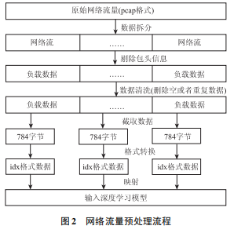
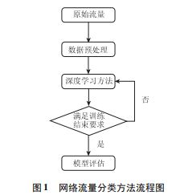
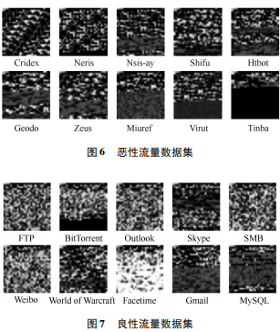

### TrafficClassification
Deep Learning Algorithms for traffic classification

##### 1) 数据预处理

##### 2) 方法流程

Some model ("./net") including：`capsnet`, `densenet`, `dnn`, `dpn`, `drn`,`googlenet`,`lenet`,
`mobilenet`, `mobilenetv2`,`pcanet`, `pnasnet`, `preact_resnet`, `resnet`, `resnext`, `senet`, `shufflenet`, `vgg`

##### 3) DataSet
数据集由 10 种恶意网络流量和 10 种良性网络流量构成

##### 4) 实施流程
**step 1** -> python train_mnist.py
